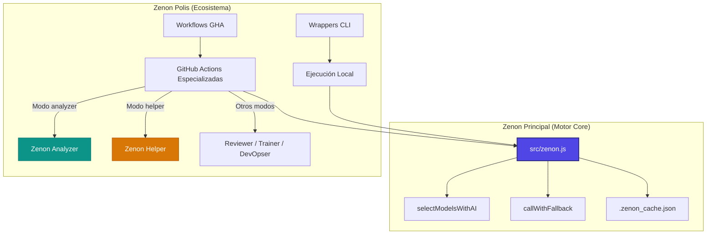
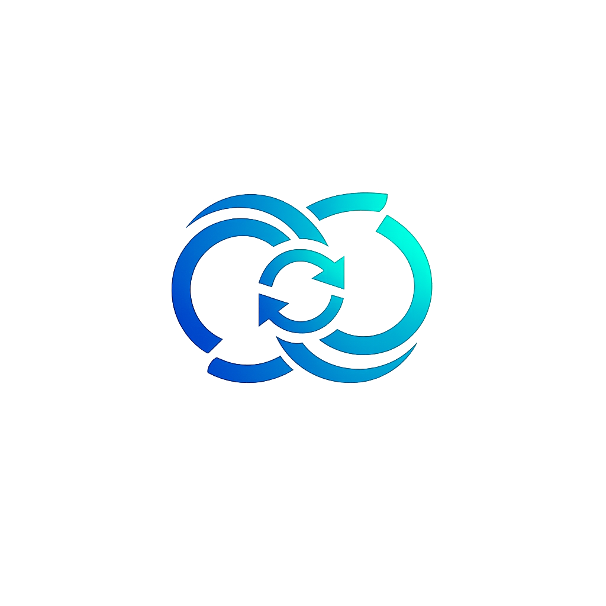

<p align="center">
  
  
</p>

<h1 align="center">Zenon AI Assistant & Polis Ecosystem</h1>

<p align="center">
  <strong>Un motor de inteligencia artificial ultraligero y un ecosistema automatizado de CI/CD para auditoría, autocorrección y asistencia de repositorios.</strong>
</p>

<p align="center">
  
  
  
  
</p>

---

## 📖 Arquitectura de la Solución

El proyecto está estructurado en dos grandes capas integradas pero conceptualmente divididas: **Zenon Principal (el Motor de Inteligencia Artificial)** y **Zenon Polis (el Ecosistema de Agentes y Automatización)**.



---

## 🧠 1. Zenon Principal (Core Engine)

<p align="center">
  
</p>

**Zenon Principal** es el motor autónomo de inteligencia artificial implementado en un único archivo modular libre de dependencias: [src/zenon.js](./src/zenon.js). Es el cerebro encargado de interpretar el código, decidir qué modelos utilizar, orquestar llamadas a APIs de múltiples proveedores y realizar correcciones directas sobre los archivos del disco.

### ⚡ Características Clave de Zenon Principal

1. **Selección Inteligente de Modelos (`selectModelsWithAI`)**:
   Analiza la complejidad de la consulta del usuario antes de ejecutarla. Si se trata de una pregunta sencilla de estructura, selecciona modelos ligeros y rápidos (`gemini-flash-lite-latest`, `gpt-4o-mini`). Si es una tarea compleja de programación o refactorización masiva, prioriza modelos potentes o de razonamiento avanzado como `DeepSeek-V3.2` o `gpt-4o`.
2. **Cascada de Fallbacks Inteligente (`callWithFallback`)**:
   Si un modelo de IA sufre límites de cuota (HTTP 429) o desbordamiento físico de tokens, Zenon reintenta la llamada de forma instantánea sobre una cadena de proveedores alternativos en cascada con backoff exponencial. Soporta de forma nativa:
   * **Google Gemini** (AI Studio)
   * **Groq**
   * **Cohere**
   * **OpenRouter**
   * **SambaNova**
   * **Cerebras**
   * **GitHub Models**
3. **Autoentrenamiento e Incrementalidad**:
   Zenon genera un perfil de conocimiento y resumen del estado del repositorio mediante una firma SHA-256 en el archivo de caché local [.zenon_cache.json](./.zenon_cache.json). Si no hay cambios físicos en los archivos, Zenon lee directamente de esta caché ahorrando más de un 90% del consumo de tokens y acelerando el tiempo de respuesta. El catálogo completo de los modelos configurables por proveedor se encuentra en [src/zenon_models.json](./src/zenon_models.json).

---

## 🏢 2. Zenon Polis (El Ecosistema)

<p align="center">
  
</p>

**Zenon Polis** es el ecosistema de automatización construido alrededor del motor core. Proporciona los envoltorios de consola (CLI wrappers) para desarrolladores locales, y las GitHub Actions compuestas que actúan como "agentes" o "pipelines" automatizados en los workflows de integración continua (CI).

### 🛠️ Módulos y Funciones de Zenon Polis

Los siguientes agentes y herramientas especializadas están implementados dentro de la suite de Zenon Polis:

#### 📊 Zenon Analyzer
<p align="left">
  
  Es el módulo encargado de compilar, trackear y visualizar las estadísticas acumuladas de llamadas a las APIs de IA. Lee del archivo de caché, muestra métricas agregadas de tokens y estima el porcentaje de consumo frente a los límites gratuitos de los planes de cada proveedor.
</p>
<br />

* **Salida Visual**: Genera un informe Markdown interactivo que incluye un gráfico circular dinámico en formato Mermaid detallando el uso por proveedor.
* **Comando CLI**: `--mode analyzer` (Acepta el flag adicional `--reset-stats` para vaciar los contadores).
* **Acción GHA**: [.github/actions/analyzer/action.yml](./.github/actions/analyzer/action.yml).

#### 🤖 Zenon Helper
<p align="left">
  
  Es el asistente interactivo del repositorio. Responde en lenguaje natural a preguntas del desarrollador sobre la arquitectura, funcionamiento o dependencias del código.
</p>
<br />

* **Búsqueda en Vivo (Grounding)**: Para evitar que la caché se desactualice si el usuario pregunta por archivos creados recientemente, realiza una búsqueda contextual en vivo buscando palabras clave dentro de los archivos del repositorio y añade los fragmentos coincidentes como contexto fresco en la consulta a la IA.
* **Comando CLI**: `--mode helper --topic "Tu pregunta aquí"`
* **Acción GHA**: [.github/actions/helper/action.yml](./.github/actions/helper/action.yml).

#### 🔍 Reviewer, Trainer & DevOpsers
<p align="center">
  
  
  
  
  
</p>

* **Reviewer** (`--mode reviewer`): Analiza las diferencias del código (`git diff`) y publica reportes técnicos con sugerencias y bugs detectados directamente en los Pull Requests de GitHub. Acción GHA: [.github/actions/reviewer/action.yml](./.github/actions/reviewer/action.yml).
* **Trainer** (`--mode trainer --topic "..."`): Utiliza el grounding de búsqueda de Google Search para actualizar la base de conocimientos con especificaciones técnicas actuales y documentación fresca en la caché. Acción GHA: [.github/actions/trainer/action.yml](./.github/actions/trainer/action.yml).
* **DevOpser/Updater/Tester** (`--mode correct` / `--mode objective`): Agentes encargados de modificar código físico en disco, autogenerar tests unitarios y hacer commits automáticos para cumplir con los objetivos técnicos especificados en Markdown.

---

## 🚀 Guía de Uso de las Funciones

### Uso en Local (Terminal)

Utiliza los wrappers CLI [zenon.ps1](./zenon.ps1) (Windows PowerShell) o [zenon.sh](./zenon.sh) (Linux/macOS) para lanzar las tareas:

```powershell
# 1. Ejecutar una auditoría general del repositorio (Modo Assist)
.\zenon.ps1 --mode assist

# 2. Consultar dudas al asistente del código (Modo Helper)
.\zenon.ps1 --mode helper --topic "¿Cómo funciona el sistema de fallbacks de proveedores?"

# 3. Ver las estadísticas acumuladas de consumo de tokens (Modo Analyzer)
.\zenon.ps1 --mode analyzer

# 4. Poner a cero el contador de estadísticas del Analyzer
.\zenon.ps1 --mode analyzer --reset-stats

# 5. Ejecutar la autocorrección automática de bugs en caliente (Modo Correct)
.\zenon.ps1 --mode correct

# 6. Cumplir un objetivo técnico leyendo un archivo Markdown (Modo Objective)
.\zenon.ps1 --mode objective --objective .\zenon_objective.md

# 7. Entrenar a Zenon en una librería o API usando Google Search (Modo Trainer)
.\zenon.ps1 --mode trainer --topic "Next.js 15 App Router routing conventions"
```

### Uso en GitHub Actions (Flujos CI/CD)

Puedes definir workflows independientes en tu carpeta `.github/workflows/` para ejecutar los módulos de Zenon Polis de manera automatizada:

* **Workflow de Asistencia (Helper)**: [.github/workflows/zenon-helper.yml](./.github/workflows/zenon-helper.yml)
* **Workflow de Estadísticas (Analyzer)**: [.github/workflows/zenon-analyzer.yml](./.github/workflows/zenon-analyzer.yml)

---

## 🔧 Configuración de los Módulos Polis en GitHub Actions

### A. Ejecutar el Core Action de Zenon (Acción Principal)

Crea un archivo `.github/workflows/zenon.yml` e invoca la acción principal apuntando al repositorio de origen:

```yaml
name: Zenon AI Assistant

on:
  push:
    branches: [ main ]
  pull_request:
    branches: [ main ]
  workflow_dispatch:
    inputs:
      mode:
        description: 'Modo de ejecución'
        required: false
        default: 'assist'
        type: choice
        options:
          - assist
          - correct
          - objective
          - trainer
          - reviewer
          - analyzer
          - helper

jobs:
  run-zenon:
    runs-on: ubuntu-latest
    permissions:
      contents: write
      pull-requests: write

    steps:
      - name: Checkout Code
        uses: actions/checkout@v4
        with:
          fetch-depth: 0

      # Recuperar la caché acumulada para optimizar costes de API y mantener estadísticas del Analyzer
      - name: Restore Zenon Knowledge Cache
        uses: actions/cache@v4
        with:
          path: .zenon_cache.json
          key: zenon-knowledge-cache-${{ github.run_id }}
          restore-keys: |
            zenon-knowledge-cache-

      # Ejecutar la Acción remota desde amglogicalis/Zenon
      - name: Run Zenon Core Action
        uses: amglogicalis/Zenon@main
        with:
          zenon-api-key: ${{ secrets.ZENON_API_KEY }}
          groq-api-key: ${{ secrets.GROQ_API_KEY }}
          cohere-api-key: ${{ secrets.COHERE_API_KEY }}
          openrouter-api-key: ${{ secrets.OPENROUTER_API_KEY }}
          samba-api-key: ${{ secrets.SAMBA_API_KEY }}
          cerebras-api-key: ${{ secrets.CEREBRAS_API_KEY }}
          gh-models-token: ${{ secrets.GH_MODELS_TOKEN }}
          mode: ${{ github.event.inputs.mode || 'assist' }}
```

### B. Usar sub-acciones independientes de Zenon Polis

Puedes usar directamente las sub-acciones específicas de Polis sin invocar la acción principal de la raíz:

#### Zenon Analyzer Action
```yaml
- name: Run Zenon Analyzer
  uses: amglogicalis/Zenon/.github/actions/analyzer@main
  with:
    reset: 'false'  # Opcional: 'true' para resetear las estadísticas a cero
```

#### Zenon Helper Action
```yaml
- name: Run Zenon Helper
  uses: amglogicalis/Zenon/.github/actions/helper@main
  with:
    query: "¿Cómo se estructuran los módulos de la aplicación?"
    zenon-api-key: ${{ secrets.ZENON_API_KEY }}
    samba-api-key: ${{ secrets.SAMBA_API_KEY }} # Opcional: Para fallbacks
```

#### Zenon Reviewer Action
```yaml
- name: Run Zenon Reviewer
  uses: amglogicalis/Zenon/.github/actions/reviewer@main
  with:
    diff-range: "HEAD~1" # Opcional
    zenon-api-key: ${{ secrets.ZENON_API_KEY }}
```

---

## 📊 Variables de Entorno para CLI Local

Crea un archivo `.env` en la raíz de tu proyecto local para configurar los proveedores de inteligencia artificial y tokens:

```env
# ==============================================================================
# PROVEEDORES DE IA (Introduce las claves API que poseas)
# ==============================================================================
# Google Gemini API Key (Recomendado/Principal)
ZENON_API_KEY=AIzaSy...
# Alternativa soportada por la API de Gemini
GEMINI_API_KEY=AIzaSy...

# Groq API Key (Opcional)
GROQ_API_KEY=gsk_...

# Cohere API Key (Opcional)
COHERE_API_KEY=co_...

# OpenRouter API Key (Opcional)
OPENROUTER_API_KEY=sk-or-v1-...

# SambaNova API Key (Opcional)
SAMBA_API_KEY=...

# Cerebras API Key (Opcional)
CEREBRAS_API_KEY=csk-...

# GitHub Models Personal Access Token (Opcional)
GH_MODELS_TOKEN=ghp_...
# Token alternativo para GitHub Models
TOKEN_GH=ghp_...
```

---

## 📥 Entradas y Configuración (`action.yml`)

| Parámetro | Descripción | Requerido | Por Defecto |
| :--- | :--- | :---: | :--- |
| `zenon-api-key` | API Key para Gemini (AI Studio). | **Sí** | — |
| `groq-api-key` | API Key para Groq (Opcional). | No | — |
| `cohere-api-key` | API Key para Cohere (Opcional). | No | — |
| `openrouter-api-key`| API Key para OpenRouter (Opcional). | No | — |
| `samba-api-key` | API Key para SambaNova (Opcional). | No | — |
| `cerebras-api-key`  | API Key para Cerebras (Opcional). | No | — |
| `gh-models-token`   | Token personal para GitHub Models (GH_MODELS_TOKEN) (Opcional). | No | — |
| `token-gh` | Token alternativo (secret: TOKEN_GH) para GitHub Models. | No | — |
| `mode` | Modo de ejecución: `assist`, `correct`, `objective`, `trainer`, `reviewer`, `analyzer` o `helper`. | No | `assist` |
| `objective-file` | Ruta al archivo Markdown que contiene las metas de `objective`. | No | `zenon_objective.md` |
| `objective` | Texto directo con el objetivo (tiene precedencia sobre `objective-file`). | No | — |
| `topic` | El tema, framework o tecnología a investigar en modo `trainer` o la consulta del asistente en modo `helper`. | No | — |
| `exclude` | Rutas o archivos separados por comas que se deben excluir del análisis. | No | `""` |
| `reset-stats` | Indica si se deben resetear las estadísticas a cero en modo `analyzer`. | No | `false` |

---

## 💻 Cómo Exportar y Traer Zenon a otros PCs

Puedes usar todo el ecosistema de Zenon en otros ordenadores o proyectos de dos formas: **instalación local en terminal** o **integración remota como acción de GitHub**.

### A. Para Uso Local en la Terminal (Cualquier PC)

Si tienes otro ordenador y quieres usar Zenon en tus proyectos locales:

1. **Copia los archivos mínimos de Zenon**:
   Solo necesitas copiar a una carpeta de tu ordenador (por ejemplo, `C:\Herramientas\Zenon` o `/usr/local/share/zenon`):
   * [src/zenon.js](./src/zenon.js)
   * [src/zenon_models.json](./src/zenon_models.json)
   * [zenon.ps1](./zenon.ps1) (para Windows)
   * [zenon.sh](./zenon.sh) (para Linux/macOS)
2. **Configura tus credenciales**:
   Crea un archivo `.env` en la misma carpeta donde colocaste `zenon.js` con tus claves API.
3. **¡No copies los scripts a cada proyecto!** (Uso mediante PATH):
   No es necesario que dupliques los archivos de Zenon dentro de cada uno de tus repositorios. Puedes ejecutarlo de dos formas:
   * **Llamándolo por su ruta absoluta**:
     ```powershell
     # Desde la carpeta de cualquier otro proyecto:
     C:\Herramientas\Zenon\zenon.ps1 --mode helper --topic "Explícame este repo"
     ```
   * **Añadiendo Zenon al PATH**:
     Añade la ruta `C:\Herramientas\Zenon` (o la ruta en tu sistema operativo) al `PATH` de tu sistema. Así podrás escribir simplemente en cualquier consola de cualquier proyecto:
     ```bash
     zenon --mode assist
     ```
4. **Heredar el conocimiento acumulado (Opcional)**:
   Si quieres que Zenon no empiece de cero a analizar tu código en la nueva máquina, puedes copiar el archivo [.zenon_cache.json](./.zenon_cache.json) generado en tu PC anterior a la raíz del nuevo proyecto. De lo contrario, Zenon creará un nuevo archivo de caché automáticamente en su primera ejecución.

---

### B. Para Uso Remoto en GitHub Actions (Cualquier Repositorio)

Para integrar Zenon en el flujo de integración continua (CI) de cualquier otro repositorio de GitHub, haz lo siguiente:

1. **Registrar las claves en los Secrets**:
   En el repositorio destino, ve a **Settings → Secrets and variables → Actions** y añade las claves de API como secretos (ej. `ZENON_API_KEY`, `SAMBA_API_KEY`, etc.).
2. **Configurar el Workflow de GitHub**:
   Crea un archivo de configuración en `.github/workflows/zenon.yml` de tu repositorio. Puedes invocar la acción principal de Zenon directamente apuntando a este repositorio central (como se muestra en el [apartado de configuración](#a-ejecutar-el-core-action-de-zenon-acci%C3%B3n-principal)).
3. **Ejecutar Sub-módulos Especializados de Forma Independiente**:
   Si quieres ejecutar específicamente el **Helper** o el **Analyzer** como pasos separados en tus workflows de otros repositorios, puedes invocarlos directamente indicando su sub-ruta en la acción (como se detalla en el [apartado de sub-acciones](#b-usar-sub-acciones-independientes-de-zenon-polis)).

---

## 🚨 Solución de Problemas (Troubleshooting)

### La caché no se actualiza o no computa estadísticas
* **Permisos del disco:** Comprueba que tienes permisos de escritura en la carpeta del repositorio para que Zenon pueda escribir y modificar `.zenon_cache.json`.
* **Regeneración forzada:** Si la caché se corrompe o se desactualiza tras cambios estructurales masivos, puedes forzar a Zenon a resetear el análisis ejecutándolo con la opción `--reset-stats` en modo `analyzer`.
* **Git inactivo:** Zenon calcula el fingerprint SHA-256 basándose en los ficheros detectados por Git. Asegúrate de inicializar Git (`git init`) y añadir los archivos (`git add .`) en tu repositorio local para un correcto funcionamiento.

### Errores 429 (Rate Limit) de la API
* **Mecanismo de resiliencia:** Zenon está diseñado para manejar esto automáticamente reintentando con otros proveedores en orden de fallback.
* **Múltiples proveedores:** Introduce al menos dos claves de proveedores diferentes en tu archivo `.env` (ej. Gemini y SambaNova) para que la cascada pueda evitar bloqueos temporales del servicio principal.

### El límite de tokens se desborda (Error 413 / 422)
* **Tamaño del contexto:** Para evitar desbordar los buffers físicos de los modelos gratuitos de Groq y Cohere, Zenon trunca automáticamente la carga útil de los archivos mayores a 100 KB.
* **Exclusiones personalizadas:** Puedes excluir carpetas grandes de logs, compilaciones o tests utilizando la propiedad `exclude` en la GitHub Action o el flag `--exclude` en local.

---

## 🔒 Filtros de Archivos Seguros

Zenon cuida tu cuota y privacidad filtrando de forma automática:
* **Carpetas excluidas**: `.git`, `node_modules`, `dist`, `build`, `venv`, `.venv`, `.env` y similares.
* **Archivos binarios y multimedia**: Imágenes, audio, vídeo, fuentes, comprimidos (`.zip`, `.rar`) y ejecutables.
* **Límite de tamaño**: Cualquier archivo individual superior a **100 KB** se ignora para evitar sobrecargar los límites de tokens de los modelos de IA.

---

## 📄 Licencia

Este proyecto es software propietario y pertenece a **Adrián (amglogicalis)**. Todos los derechos reservados. Consulta el archivo [LICENSE](LICENSE) para más detalles sobre sus términos de uso y exclusión de fines comerciales.
